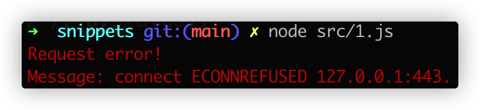

# 浏览器能自动使用代理，你知道吗？

## 背景
以前我认为，只要开启代理，本地所有请求都会先经过代理再访问网络资源。直到这两天，用 NodeJs 访问 Google 出现报错。

代码长这样：
```javascript
const chalk = require('chalk');
const axios = require('axios');

axios
  .get('https://www.google.com')
  .then((a) => {
    console.log(chalk.green('Request finish, status: %s.'), a.status);
  })
  .catch((e) => {
    console.log(chalk.red('Request error!\nMessage: %s.'), e.message);
  });
```

**执行结果如下：**


**此时我的 Chrome 却能正常访问 Google！**


**此时我的表情：**
<div align="center"></div>

经过搜索才知道为什么我写的代码却无法访问 Google，而 Chrome 却能访问。原来浏览器竟然会自动获取代理设置并使用，而我写的代码没有使用代理而是直接访问网络资源！

**而浏览器自动获取代理设置也另有一番故事！**

## 历史
- 20世纪90年代，被代理设置这种重复劳动所折磨的公司和程序员们，决定做些事情改变这种现状
- 1996年，网景为自家浏览器Netscape Navigator 2.0设计了一套代理自动配置格式（英语：Proxy auto-config，简称PAC）
- 1999年，Microsoft、Sun（研发Java的公司，现被Oracle收购）、Inktomi、RealNetworks等公司共同起草了网络代理自动发现协议（英语：Web Proxy Auto-Discovery Protocol，简称WPAD）
- 1999年，WPAD在Microsoft Internet Explorer 5.0中被首次引入
- WPAD的互联网草案已于1999年12月到期，但今天仍受主要浏览器的支持

## 现代浏览器代理设置
现代浏览器实现了多种级别的代理设置，下面是三种常用的设置：

- **手动代理配置/全局模式**：为所有的请求规定一个主机名和端口作为代理，另外可以配置例外的域名列表（如localhost等），访问这个列表中的域名时不使用代理服务器
- **代理自动配置（PAC）**：规定一个指向PAC文件的URL，这个文件中包括一个选择代理服务器的JavaScript程序。这个方法适合复杂设置，可以针对不同网址配置不同的代理服务器，也可以指定某些网站使用或不使用代理服务器
- **网络代理自发现协议（WPAD）**：浏览器通过DHCP和DNS来搜索PAC文件


## 参考
- https://zh.wikipedia.org/wiki/%E7%BD%91%E7%BB%9C%E4%BB%A3%E7%90%86%E8%87%AA%E5%8A%A8%E5%8F%91%E7%8E%B0%E5%8D%8F%E8%AE%AE
- https://zh.wikipedia.org/wiki/%E4%BB%A3%E7%90%86%E8%87%AA%E5%8A%A8%E9%85%8D%E7%BD%AE
- https://cn.theastrologypage.com/web-proxy-autodiscovery-protocol
- https://web.archive.org/web/20210302043814/http://findproxyforurl.com/wpad-introduction/
- https://xz.aliyun.com/t/1739/
- https://cloud-atlas.readthedocs.io/zh_CN/latest/infra_service/dns/wpad_protocol.html
- https://web.archive.org/web/20060424005037/http://wp.netscape.com/eng/mozilla/2.0/relnotes/demo/proxy-live.html
- https://web.archive.org/web/20160826134107/http://jdebp.eu/FGA/web-browser-auto-proxy-configuration.html
- https://web.archive.org/web/20201210040800/http://www.findproxyforurl.com/
