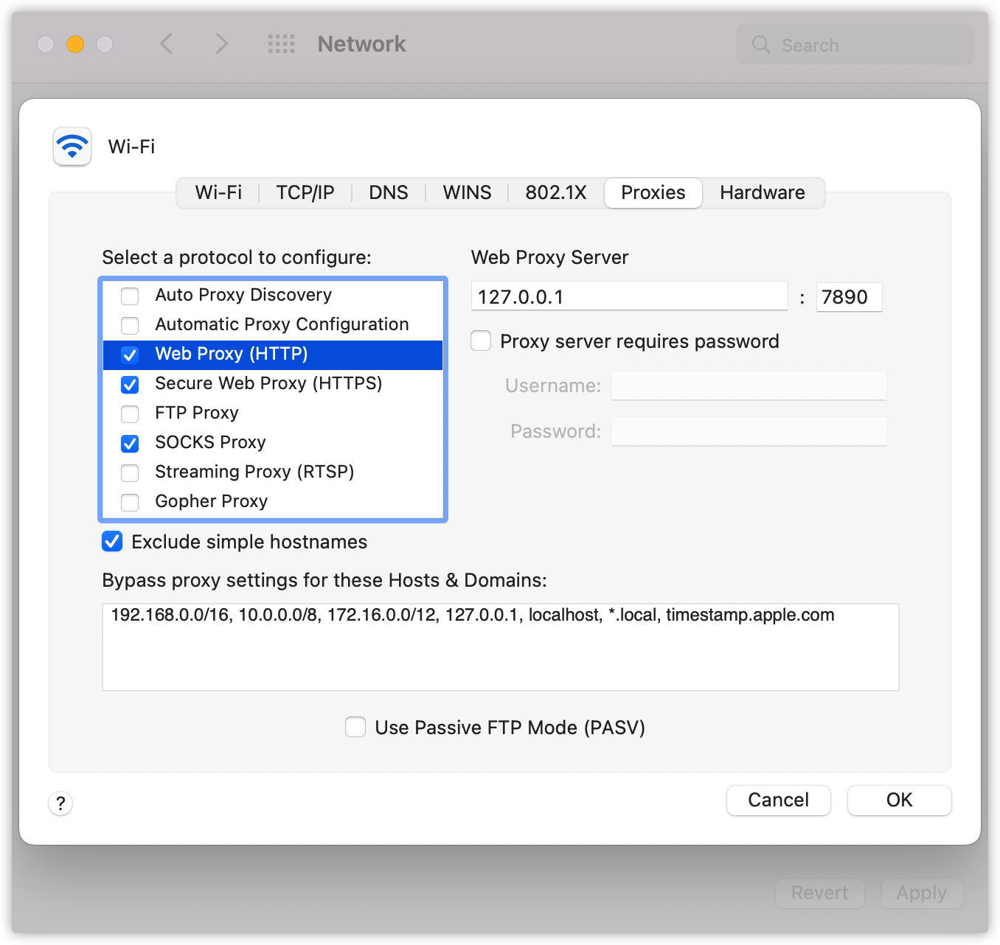

# 浏览器能自动使用代理，你知道吗？

## 背景
以前我认为，只要开启代理，本地所有请求都会先经过代理再访问网络资源。直到这两天，用 `Node.js` 访问 `Google` 出现报错。

代码长这样：
```javascript
const chalk = require('chalk');
const axios = require('axios');

const url = 'https://www.google.com';

axios
  .get(url)
  .then((a) => {
    console.log(chalk.green(`Request ${url} finish, status: ${a.status}.`));
  })
  .catch((e) => {
    console.log(chalk.red(`Request ${url} error!\nMessage: ${e.message}.`));
  });
```

**执行结果如下：**


**此时我的 `Chrome` 却能正常访问 `Google`！**


**此时我的表情：**
<div align="center"></div>

查阅资料后才发现其中的原因：浏览器会自动获取代理配置并使用，通常我们写的代码是直接访问网络资源而不会使用代理！

**查阅资料的同时还有其他发现，代理自动配置竟然已经有30年的历史！**

## 代理设置的历史
- 20世纪90年代，代理设置还是一种重复性的体力劳动，饱受折磨的IT公司和程序员们决定改变这种现状
- 1996年，网景为自家浏览器 `Netscape Navigator 2.0` 设计了一套代理自动配置格式（`Proxy Auto Config`，简称 `PAC` ）
- 1999年，Microsoft、Sun（研发 `Java` 的公司，现被 `Oracle` 收购）、Inktomi、RealNetworks等公司共同起草了网络代理自动发现协议（`Web Proxy Auto-Discovery Protocol`，简称 `WPAD` ）
- 1999年，`WPAD` 在 `Microsoft Internet Explorer 5.0` 中被首次引入
- `WPAD` 的互联网草案已于1999年12月到期，但时至今日主流浏览器仍然在使用 `WPAD`

## 代理设置的分类
现代浏览器实现了多种级别的代理设置，下面是三种常用的设置：

- **手动代理配置/全局模式**：为所有的请求规定一个主机名和端口作为代理，另外可以配置例外的域名列表（如 `localhost` 等），访问这个列表中的域名时不使用代理服务器
- **代理自动配置（PAC）**：规定一个指向 `PAC` 文件的 `URL`，这个文件中包括一个选择代理服务器的 `JavaScript` 程序。这个方法适合复杂设置，可以针对不同网址配置不同的代理服务器，也可以指定某些网站使用或不使用代理服务器
- **网络代理自发现协议（WPAD）**：浏览器通过 `DHCP` 和 `DNS` 来搜索 `PAC` 文件

## 代理设置的工作流程
- 手动代理配置
  - 用户手工配置代理的主机名和端口
  - 软件根据手动代理配置，将 `HTTP` 请求转发到对应的主机端口

- PAC
  - 用户手工配置 `PAC` 的 `URL`
  - 系统按 `PAC` 的 `URL` 下载该配置文件
  - 软件根据 `PAC` 文件配置对所有 `HTTP` 请求进行分发

- WPAD
  - 如果系统设置中 `WPAD` 被启用，则通过 `DHCP` 或 `DNS` 查找 `PAC` 配置文件
  - 系统找到 `PAC` 的 `URL` 之后，则下载该配置文件
  - 软件根据 `PAC` 文件配置对所有 `HTTP` 请求进行分发

## 实际示例


上图是我电脑的代理配置情况，可以看到左侧的 `protocol` 选框包含了上述三种类型代理设置，其中：
- **Automatic Proxy Configuration** 对应 **PAC**
- **Auto Proxy Discovery** 对应 **WPAD**
- 其他都可以认为是 **手动代理配置**

我们更常用到的是手动代理配置，常见的代理软件和抓包软件启动之后都会自动配置 `Web Proxy`、`Secure Web Proxy` 以及 `SOCKS Proxy`，上图中 `Web Proxy` 的服务器和端口是 `127.0.0.1:7890`。接着打开浏览器访问 `https://www.google.com/` 时，请求会被转发到 `127.0.0.1:7890`，代理软件或抓包软件可能会对请求做一些处理然后再转发到公网。

手动代理配置一般只影响个人主机，而 `PAC` 和 `WPAD` 则可以用于范围更广的局域网代理或开放代理。

> Tips：
> - 1、代理软件和抓包软件同时开启时，其中一个可能无法正常工作，因为后启动的软件会覆盖之前的代理配置，可以通过设置转发解决
> - 2、浏览器可以禁用代理服务，使用以下命令行启动浏览器试试 `/Applications/Google\ Chrome.app/Contents/MacOS/Google\ Chrome --no-proxy-server`

## 升级：自动使用代理
咱们可以对文章开头的那段 `Node.js` 代码做个升级，简单实现一个自动使用代理的程序。具体代码如下：

```javascript
const chalk = require('chalk');
const axios = require('axios');
const { execSync } = require('child_process');

function getProxyInfo() {
  const out = execSync('networksetup -getwebproxy Wi-Fi', { encoding: 'utf8' });

  console.log('====System Proxy Info====');
  console.log(out);

  const lines = out.split('\n');
  const values = lines.map((l) => l.replace(/\s/g, '').toLowerCase().split(':'));
  const proxyInfo = values.reduce((a, [key, val]) => {
    a[key] = val;
    return a;
  }, {});

  return proxyInfo.enabled === 'yes' ? { host: proxyInfo.server, port: +proxyInfo.port } : null;
}

const proxy = getProxyInfo();
const url = 'https://www.google.com';

axios
  .get(url, { proxy })
  .then((a) => {
    console.log(chalk.green(`Request ${url} finish, status: ${a.status}.`));
  })
  .catch((e) => {
    console.log(chalk.red(`Request ${url} error!\nMessage: ${e.message}.`));
  });
```

这段代码的主要修改点是新增了一个 `getProxyInfo` 函数，该函数自动读取系统的代理配置，在请求网络资源时使用该配置。

**执行结果如下：**


## 参考
- https://zh.wikipedia.org/wiki/%E7%BD%91%E7%BB%9C%E4%BB%A3%E7%90%86%E8%87%AA%E5%8A%A8%E5%8F%91%E7%8E%B0%E5%8D%8F%E8%AE%AE
- https://zh.wikipedia.org/wiki/%E4%BB%A3%E7%90%86%E8%87%AA%E5%8A%A8%E9%85%8D%E7%BD%AE
- https://cn.theastrologypage.com/web-proxy-autodiscovery-protocol
- https://web.archive.org/web/20210302043814/http://findproxyforurl.com/wpad-introduction/
- https://xz.aliyun.com/t/1739/
- https://blog.csdn.net/vevenlcf/article/details/80887753
- https://cloud-atlas.readthedocs.io/zh_CN/latest/infra_service/dns/wpad_protocol.html
- https://web.archive.org/web/20060424005037/http://wp.netscape.com/eng/mozilla/2.0/relnotes/demo/proxy-live.html
- https://web.archive.org/web/20160826134107/http://jdebp.eu/FGA/web-browser-auto-proxy-configuration.html
- https://web.archive.org/web/20201210040800/http://www.findproxyforurl.com/
